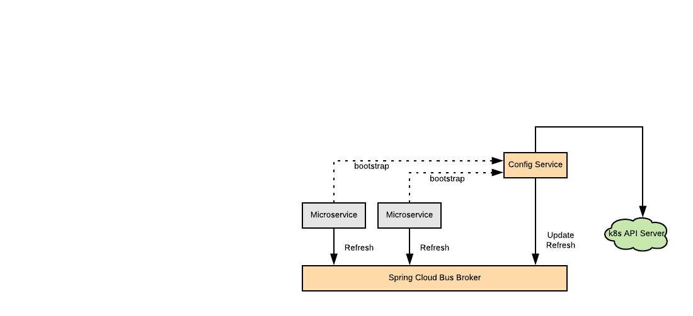

# Spring Cloud Configuration in Kubernetes



Fabric8 is a community-maintained Java library that offers a Kubernetes client 
implementation. Fabric8 Kubernetes-Client offers implementation of K8s
operator pattern that (mostly) typical to what offered in client-go library.
  
In this experiment I leveraged Fabric8 Kubernetes-Client library to implement 
a hybrid solution to configure spring-based services running in a K8s cluster. 
The solution offers a centralized server to cater configuration data while 
leveraging a shared informer event handler that reacts to ConfigMap resources 
events in the a clusters namespace.

The experiment update the config module in Spring-Cloud-Kubernetes project to 
hit a Restful endpoint of the central service to configure a target microservice 
with a ConfigMap that has a name matches the name of the microservice 
(as defined by spring.application.name property). a ConfigMap Lister helps to 
allocate a desired ConfigMap for a specific microservice. 

A shared-index-informer is configured with an event-handler to publish an
actuator refresh message via a Spring Cloud Bus every time a ConfigMap receives
an event (updated/deleted). If a remote configured microservice listens on the same bus
(backed by a rabbitMQ broker in this case), it would get auto-refreshed.

This implementation requires running this configuration service and a RabbitMQ broker.
It needs also remote microservices to include `spring-cloud-starter-bus-amqp` dependency.
The remote service needs to disable existing `reload` and `enableAPI` options so it
does not use existing method to ping K8s API server. Instead it should enable new options
to enable using the central configuration service and to define the `uri` in order to 
reach out to it.

```yaml
spring:
  cloud:
    kubernetes:
      enabled: true
      config:
        enabled: true
        enableApi: false
        enableK8sController: true
        uri: [service uri]
```


